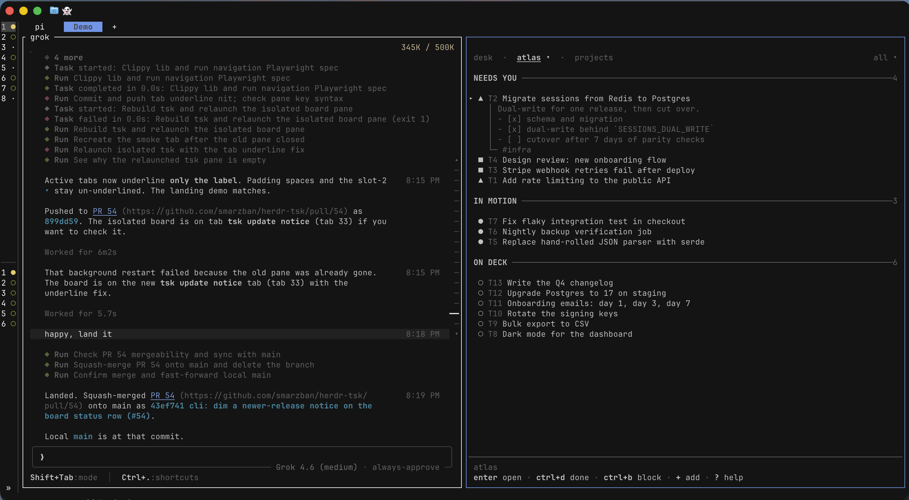
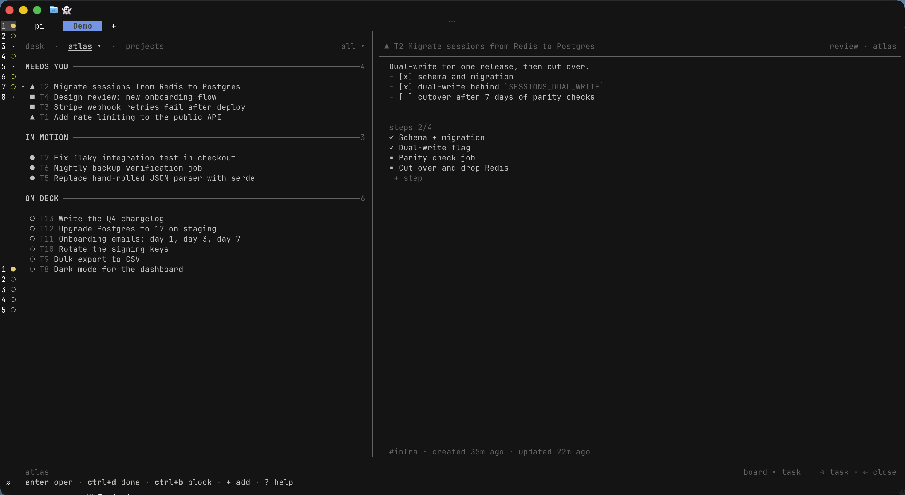

# tsk

A terminal task board for you and your agents: one shared queue, a TUI for you, a CLI for them.

Keep the next task, the work in progress, and the things waiting on you in view.
Press `+` to capture a thought, add notes and steps when it needs a plan, and give
your agent the task number when you're ready to work on it.

### the flow



In Herdr, **prefix+t** opens your board and **prefix+a** opens quick capture.
Click a task's `T` number to copy it, then paste it into your agent conversation.

### Room to think



In a wide pane, `→` opens task details beside the board; `←` brings you back.
Press `Enter` for a full-screen task and `Esc` to return. For a standalone board,
run `tsk` in your terminal.

## Quickstart

### Install

```sh
curl -fsSL https://gettsk.sh/install.sh | sh
```

Or install with Homebrew:

```sh
brew install smarzban/tap/tsk
```

The installer sets up PATH for Bash and Zsh. If prompted, reopen your terminal
or run the printed `export` command before continuing.

### Add to Herdr

```sh
tsk setup herdr
herdr server reload-config
```

### Give your agent the skill

Install the tsk skill so your agent knows how to read the board, add tasks, and
update their status and steps:

```sh
tsk setup pi
```

Replace `pi` with `claude`, `cursor`, `grok`, or `codex` for your agent. This
installs the skill in its user-level skills directory.
[Other skill directories and setup options](https://gettsk.sh/docs/cli/#setup).

### Open the board

Run `tsk`, or press **prefix+t** in Herdr.

### Add a task

```sh
tsk add -t "your task title"
```

Or press **prefix+a** in Herdr, or ask your agent to add a task to the board.

For example: “Add a task to the board to fix the login timeout, with steps to reproduce
the bug.”

[Installation details and upgrades](https://gettsk.sh/docs/install/).

## Usage

Mouse or keyboard, your choice. Click tabs to switch views, double-click a task
to open it, and scroll through your board. The actions along the bottom are
clickable too, including adding a task and changing its status.

Prefer the keyboard? A few keys for everyday use:

| Key | Action |
| --- | --- |
| `↑` / `↓` or `j` / `k` | Move between tasks |
| `→` / `←` | Peek at a task and close the peek in narrow panes; move between board and task views in wide panes |
| `+` | Add a task |
| `Enter` | Open the selected task |
| `ctrl+s` | Start a ready task or reopen a done task |
| `ctrl+r` | Move an open task to review, or back to ready |
| `ctrl+d` | Mark the selected task done |
| `p` | Switch projects |
| `d` | Show or hide completed tasks |
| `?` | Show all shortcuts |

[Full keymap](https://gettsk.sh/docs/keys/) ·
[Board guide](https://gettsk.sh/docs/board/) ·
[CLI reference](https://gettsk.sh/docs/cli/)

## Docs

See the [user guide](https://gettsk.sh/docs/) for installation, task management,
agent setup, and the full CLI reference.

## Contributing and security

See [CONTRIBUTING.md](CONTRIBUTING.md) for development and pull-request guidance.
Report vulnerabilities privately as described in [SECURITY.md](SECURITY.md).

## License

[MIT](LICENSE)
