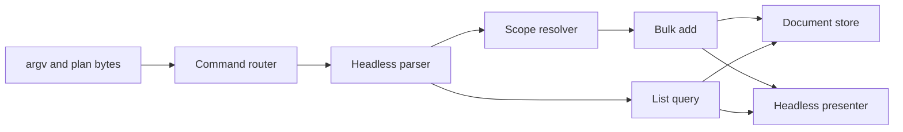

# Headless add

## Brief

### Problem / intent

An agent next to the board (or a person in a terminal) has no scriptable way to put work on the board. The binary only opens a TUI. Driving the board by keystrokes is brittle and title-only. The need is to capture one task or a whole plan, with notes, onto the same store the live board already watches.

### Scope & non-goals

In: headless `add` and read-only `list` on the existing `herdr-tasks` binary. Create one task from flags, or a plan from a JSON array; list what is on the board so a caller can dedupe before adding and verify after. Notes and project/scope. A result the caller can act on. Discovery: `--help` usage on both subcommands (JSON shapes shown inline), an agent-facing skill doc, and a routing line in the repo instructions. Same store the board uses, so a running board picks the new rows up.

Out: edit, status, delete (mutation beyond create needs its own idea-stage debate: agent-flipped status collides with "human status is source of truth", and edit/delete drag in stale-target and divergent-write error contracts). A second crate. A herdr plugin action. Driving the TUI. Client-supplied ids / `T1` aliases / idempotency keys. All-or-nothing batches. Echoing notes back. Changing how the board looks or how human-status verbs work.

### Chosen approach

Same binary, subcommand `add`. Domain `create` plus the existing lock/merge write. Best-effort per item, one durable write of the successes. Two front doors, one engine: flags for a person at a terminal, JSON for an agent dumping a plan.

Rejected: driving the TUI (brittle). A separate CLI crate (packaging for one verb). One process per task (20 agent rounds). All-or-nothing (one bad title throws away the plan).

### Resolved key decisions

- Command: `herdr-tasks add`. No args still opens the board. Interactive `capture` is unchanged.
- Flags (batch of one): `-t` / `--title`, `-n` / `--notes`, `-p` / `--project`, `--global`.
- Plan: JSON array on stdin or `--file`. `--file -` means stdin. Shape: `[{title, notes?, project?}, ...]`. Always an array.
- Plan-source detection is argv-only. Plan mode iff `--file` is present, or no item flags (`-t`/`-n`/`-p`/`--global`) and stdin is not a TTY. With any item flag present, stdin is never read. Mixing usage is item-flags plus `--file` only. `add` with no flags, no `--file`, and a TTY stdin is a usage error, never a hang.
- `list`: human-readable lines by default, `--json` for machines (`id`, `title`, `status`, `project` per task). Read-only, no lock contention semantics beyond a plain load.
- `project` / `-p` follows the board `!p` rules: omitted is the invocation default (cwd repo if known, else global); JSON `null` is global; flags use `--global` for global (no magic string); basename is a unique ASCII-case-insensitive match; a slash is a verbatim path; absent or ambiguous basename stays verbatim. Kept deliberately: null-vs-omitted will surprise a hand-writing agent, but consistency with board `!p` semantics is worth more than bluntness. Verbatim fallback means a typo'd project silently creates a new scope; `list` is the check, and the skill doc says so.
- Store: same `default_state_dir()` as the board (`HERDR_PLUGIN_STATE_DIR`, else XDG). An explicit `--state-dir` always wins over the env: silently ignoring an explicit flag is the worse trap (a caller believes they wrote to a scratch dir and hit the live board store instead). The board-side consumer never passes the flag, so board divergence is not a real risk.
- Create always lands as human status `ready`. Provenance is `Capture`. No context capsule. No `agent_meta`. Headless add does not link the new task to the invoking pane.
- Identity is the domain UUID. No `T1` scheme.
- JSON result (stdin / `--file` only): `{"created":[{"i","id","title"}],"failed":[{"i","title","code","error"}]}`. No notes. `i` is the input index. `code` is a small stable machine-matchable set; `error` is human wording and not a contract.
- Initial code set, closed by construction and stable once shipped (may grow): `empty-title` (title absent, blank, or whitespace-only), `invalid-title` (title contains CR, LF, or any other C0 control character, U+0000–U+001F), and `invalid-item` (array element is not an object; `title` is present but not a string; or a known field `notes`/`project` has a wrong type). `notes: null` means absent. Unknown fields do not invalidate an item. Per-item, so one malformed element never discards the plan. Unparseable JSON or a non-array is exit 2. An ambiguous or unknown project falls back verbatim. Store I/O is exit 3 (commit indeterminate).
- Flag success is one line on stdout: `added <title>`. Flag failure is stderr plus a non-zero exit.
- Exit contract: `0` every item created. `1` one or more item refusals: retry the `failed` subset only (resubmitting successes duplicates, titles are not unique). `2` usage or parse error: nothing persisted, no JSON result, fix the input and resubmit whole. `3` store I/O: commit state is indeterminate, no JSON result; caller verifies with `list` and retries only what is missing. An agent must never whole-plan-retry an exit-1 run, and must never whole-plan-retry an exit-3 run.
- `--help` on `add` and `list` documents the JSON shapes and the exit contract; a skill doc carries the usage rules `--help` is too terse for (retry-failed-only, exit-3 list-then-retry-missing, the misfiling caveat below).

### Glossary terms touched

add command, list command, bulk add, invocation default, tiny result, exit contract, error code

### ADRs

- [ADR-0001](../adr/ADR-0001-positional-command-router.md) positional command router
- [ADR-0002](../adr/ADR-0002-shared-scope-resolver.md) shared scope resolver, bit-identical board `!p`

## Acceptance Criteria

*Persisted* means a later `list` against the same store returns that task. *Nothing persisted* means a later `list` against the same store shows no task created by that invocation. *Listed* means the task appears in `list` (it is not soft-deleted). *Exactly once* means one row per task id.

**AC-1** Given a usable store, when add is invoked with a non-empty title and no plan input, one task with that title (leading and trailing whitespace trimmed, internal whitespace preserved) and human status `ready` is persisted, and stdout is one line `added <title>` using that same trimmed title. This diverges from board quick-add, which whitespace-collapses because it tokenizes `!p`.
*(Verification type: **test-backed**, integration.)*

**AC-2** When add is given notes that contain non-whitespace, those notes are stored on the created task.
*(Verification type: **test-backed**, integration.)*

**AC-3** When add is given no notes, or notes that are only whitespace, the created task has no notes.
*(Verification type: **test-backed**, integration.)*

**AC-4** Scope resolution: omitting project uses the invocation default; `--global` or JSON `project: null` is global; a project string follows the board `!p` rules (unique ASCII-case-insensitive basename match, a slash is verbatim, otherwise verbatim including typos).
*(Verification type: **test-backed**, integration.)*

**AC-5** A valid plan array from `--file`, from stdin, or from `--file -` creates one task per valid item. Unknown fields on an item do not invalidate it.
*(Verification type: **test-backed**, integration.)*

**AC-6** Usage errors exit 2, persist nothing, and print no tiny result: item flags mixed with `--file`, `--global` together with `-p`, add on a TTY with no flags and no `--file`, or flag add with `-t` missing.
*(Verification type: **test-backed**, integration.)*

**AC-7** Flag add with an empty or whitespace-only title exits 1 and persists nothing.
*(Verification type: **test-backed**, integration.)*

**AC-8** A mixed plan persists only the valid items, reports each invalid item under `failed` with code `empty-title`, `invalid-title`, or `invalid-item`, and exits 1.
*(Verification type: **test-backed**, integration.)*

**AC-9** Unparseable JSON or a non-array plan exits 2, persists nothing, and prints no tiny result.
*(Verification type: **test-backed**, integration.)*

**AC-10** An empty plan array exits 0 with empty `created` and `failed`.
*(Verification type: **test-backed**, integration.)*

**AC-11** The tiny result includes `i`, `id`, and `title` on each created row and `i`, `title`, `code`, and `error` on each failed row. `failed[].title` is the trimmed input string when the item had a string title, otherwise null. It does not include notes.
*(Verification type: **test-backed**, integration.)*

**AC-12** `--state-dir` wins over the environment. Otherwise add and list use the same store lookup as the board.
*(Verification type: **test-backed**, integration.)*

**AC-13** `list` includes every not-soft-deleted task exactly once, including done.
*(Verification type: **test-backed**, integration.)*

**AC-14** Default `list` prints one human line per listed task, and that line contains the task's title.
*(Verification type: **test-backed**, integration.)*

**AC-15** `list --json` rows carry `id`, `title`, `status`, and `project`. Global tasks have `project` null.
*(Verification type: **test-backed**, integration.)*

**AC-16** `--help` on add and on list describes the plan JSON shape and the exit contract.
*(Verification type: **test-backed**, integration.)*

**AC-17** An agent skill documents that an exit-1 run must retry only the failed subset, that an exit-3 run has indeterminate commit so the caller lists and retries only what is missing, and that a typo'd project silently files under a new scope.
*(Verification type: **test-backed**, unit.)*

**AC-18** The repo's agent instructions route callers to add and list.
*(Verification type: **test-backed**, unit.)*

**AC-19** Router safety: an unknown first positional exits 2 and does not open the board; tokens after the subcommand never select a surface (`add -t capture` stays add); a subcommand wins over the capture-mode env; `--find-board-pane` with trailing args exits 2.
*(Verification type: **test-backed**, integration.)*

**AC-20** When add or list hits store I/O failure, the process exits 3, writes stderr, prints no tiny result, and does not claim whether the write committed. The caller verifies with `list` and retries only what is missing.
*(Verification type: **test-backed**, integration.)*

**AC-21** When add is given a title that contains CR, LF, or any other C0 control character (U+0000–U+001F), that item is refused with code `invalid-title`. Flag path exits 1 and persists nothing. Plan path puts the item in `failed`. Notes may contain those characters.
*(Verification type: **test-backed**, integration.)*

### Negative criteria

**NC-1** No edit, status, or delete subcommand ships in this feature.

**NC-2** Add and list are not a second crate or binary.

**NC-3** No herdr plugin action is added for add or list.

**NC-4** No client-supplied id or `T1` alias is accepted or printed as identity.

**NC-5** The board's look and human-status verbs are unchanged.

### Verification map

| ID | Oracle |
| --- | --- |
| AC-1 | integration |
| AC-2 | integration |
| AC-3 | integration |
| AC-4 | integration |
| AC-5 | integration |
| AC-6 | integration |
| AC-7 | integration |
| AC-8 | integration |
| AC-9 | integration |
| AC-10 | integration |
| AC-11 | integration |
| AC-12 | integration |
| AC-13 | integration |
| AC-14 | integration |
| AC-15 | integration |
| AC-16 | integration |
| AC-17 | unit |
| AC-18 | unit |
| AC-19 | integration |
| AC-20 | integration |
| AC-21 | integration |

### Deferred

- Rebrand to a standalone app: brand "Tasks" (with tagline), command `tsk` via crate rename to `tasks-tui` with `[[bin]] tsk`, domain gettasks.app, plugin identity `herdr-tasks` unchanged. Its own feature; nothing in it enters this one. This feature ships under `herdr-tasks` naming everywhere.

### Glossary terms touched

persisted, nothing persisted, listed, exactly once

## Design

Feature fit: same process, same task domain, same document store, same context resolver. New headless path sits beside the board and capture form. Bulk add is a sibling of the existing one-item capture save, not a fork of the store write.

### Components

1. **Command router** — chooses which surface runs. Kind: process dispatcher.
   - In: argv including argv0, optional capture-mode env.
   - Out: board, capture form, add (rest of argv), list (rest of argv), find-board-pane, global help, or usage.
   - Contract: first non-flag argument is the subcommand. Closed global-flag set, recognized only before that argument: `--find-board-pane`, `--help`. Tokens after the subcommand never select a surface. `add -t capture` and `add -t "--find-board-pane"` stay add. Capture-mode env applies only when there is no subcommand; a subcommand wins. No positional and no global flag still opens the board. Unknown first positional is usage (exit 2 via Headless presenter), never the board. Unknown flag before any positional is usage, never the board. Subcommand flags such as `--state-dir` are not valid before the subcommand. `--find-board-pane` with trailing args is usage (exit 2). `--find-board-pane` not-found stays exit 1, outside the add/list exit contract. `--help` alone prints binary usage that names add and list. `--help` with trailing args is usage.
   - Errors: usage only. Does not read the store or create tasks.

2. **Headless parser** — turns add/list argv and plan bytes into a request or a usage/parse error. Kind: input adapter. Untrusted input stops here.
   - In: rest of argv after the subcommand, optional plan bytes, injectable `stdin_is_tty` seam (tests never read a live TTY).
   - Out: flag-add request, plan-add request (decoded items), list request, subcommand help, or error.
   - Contract: flags (`-t`/`--title`, `-n`/`--notes`, `-p`/`--project`, `--global`, `--state-dir`, `--file`, `--json` on list) are batch-of-one. Plan-source detection is argv-only: plan mode iff `--file` is present, or no item flags and `stdin_is_tty` is false. `--file -` means stdin. With any of `-t`/`-n`/`-p`/`--global` present, stdin is never read. Mixing usage is item-flags plus `--file` only. No item flags, no `--file`, and `stdin_is_tty` is usage, never a hang. Missing `-t` on flag-add is usage. `--global` together with `-p` is usage. Empty or whitespace title on flags is an item refusal (not usage). Titles are trimmed at both ends only; internal whitespace is preserved (unlike board quick-add, which collapses because it tokenizes `!p`). After trim, a title that contains any C0 control (U+0000–U+001F) is `invalid-title`. A plan that is not JSON or not an array is a parse error. Per-item: not an object, `title` present but not a string, or `notes`/`project` present with a non-string non-null type, is `invalid-item`; absent/blank/whitespace title is `empty-title`; `notes: null` means absent. Unknown fields on an object do not invalidate it. Whitespace-only notes become absent. `--state-dir` on the request always wins over the environment. `--help` after add or list is subcommand help.
   - Errors: usage and parse (nothing persisted, no tiny result). Per-item codes stay on the request for Bulk add; they are not process errors.

3. **Scope resolver** — project string or global intent plus invocation snapshot to a task scope. Kind: pure rule.
   - In: omitted / global / project string, context snapshot, domain task list for candidates.
   - Out: global or project path.
   - Contract: path matcher only. Candidate set is project paths on tasks in the current domain (no soft-delete filter), plus the snapshot default project path if any, plus this-repo. Unique ASCII-case-insensitive basename match; a slash is verbatim; absent or ambiguous basename is verbatim. Bit-identical to board `!p` path resolution after the lift. The `!p` token split stays in board apply, which becomes a call site. Plan writes the copy-drift regression first.
   - Errors: none. Typos do not fail.

4. **Bulk add** — creates every valid prepared item and makes one durable write of the successes. Kind: application use case. Sibling of one-item capture save.
   - In: prepared items (title, notes, scope) plus already-failed items, document store, task domain.
   - Out: created rows (id, title, index), failed rows, persist-ok or store failure.
   - Contract: calls domain create only (human status ready, domain id, provenance `Capture`). Passes no context capsule and no `agent_meta`. One store write of the success set. Does not write if the success set is empty (flag empty-title / invalid-title, or every item failed). A store error is reported as store I/O; commit may already be visible. Does not format output or choose exit codes.
   - Errors: store I/O. Domain empty-title should not appear if the parser already refused; if it does, treat as `empty-title` on that item.

5. **List query** — reads the store and yields listed tasks. Kind: application use case.
   - In: document store (same lookup as add, including `--state-dir`).
   - Out: one row per not-soft-deleted task, including done. Fields: id, title, status, project (null if global).
   - Contract: plain load, no extra lock semantics. Exactly one row per task id. Does not format.
   - Errors: store I/O.

6. **Headless presenter** — prints the outcome and sets the exit code. Kind: output adapter. Owns the add/list exit contract.
   - In: parser error, add outcome, list rows, help text request, store I/O error. Find-board-pane does not flow through this component.
   - Out: stdout, stderr, exit 0 / 1 / 2 / 3.
   - Contract: flag success is one line `added <title>`. Plan success or partial is the tiny result (`created`: i, id, title; `failed`: i, title or null, code, error; no notes). `failed[].title` is null when the item had no string title. Empty plan array is exit 0 and empty created/failed. Exit 0 only when every item was created. Exit 1 when any item was refused (retry `failed` only). Exit 2 for usage or parse (stderr, no tiny result, nothing persisted). Exit 3 for store I/O (stderr, no tiny result, commit indeterminate; caller lists and retries what is missing). List default: one human line per row containing the title. List machine form: id, title, status, project; global project is null. Add/list `--help` describes the plan JSON shape and the exit contract including 0/1/2/3 and the indeterminate meaning of 3.
   - Errors: none of its own.

### Outside the checker

1. **Task domain** — create, ready status, notes, identity. Unchanged contract. Bulk add is a caller.
2. **Document store** — load, locked merge save, default state-dir lookup. `--state-dir` is applied by the caller before construct; the store does not read that flag.
3. **Context resolver** — invocation snapshot and invocation default. Unchanged. Scope resolver and omitted-project use it.
4. **Agent discovery** — skill doc and the routing line in repo instructions. A deliverable, not a runtime component. No contracts. No other component may depend on it.

### Data flow and key state

Untrusted argv and plan bytes enter the Command router, then the Headless parser. The parser decodes the plan, classifies per-item codes, and records `--state-dir`. Scope resolver turns each item's project into a scope using the context snapshot and current domain paths. Bulk add applies domain create to valid items and issues one document-store write. List query loads the same store and drops soft-deleted tasks. Headless presenter is the only writer to stdout/stderr/exit. Durable state is the existing task document. Headless path holds no session state.

### Trust and failure boundaries

Untrusted: argv, plan bytes, `--file` path contents, env used for default state dir and context. Validated at the Headless parser. Domain create remains a second empty-title check.

Failures:
- Router/parser usage or parse: presenter exit 2, no write.
- Per-item invalid: bulk add skips that item, one write of the rest, presenter exit 1 plus tiny result.
- Empty success set (all items failed, or flag empty title): no write, presenter exit 1.
- Store I/O: presenter stderr, no tiny result, exit 3, commit indeterminate.
- Find-board-pane not found: handled by the existing binary path, exit 1, unchanged, outside this contract. Does not enter Headless presenter.

### Criterion-to-component map

| Criterion | Component |
| --- | --- |
| AC-1 | Headless parser, Bulk add, Headless presenter, Task domain, Document store |
| AC-2 | Headless parser, Bulk add, Task domain |
| AC-3 | Headless parser, Bulk add, Task domain |
| AC-4 | Scope resolver, Context resolver |
| AC-5 | Headless parser, Bulk add, Document store |
| AC-6 | Command router, Headless parser, Headless presenter |
| AC-7 | Headless parser, Headless presenter |
| AC-8 | Headless parser, Bulk add, Headless presenter, Document store |
| AC-9 | Headless parser, Headless presenter |
| AC-10 | Headless parser, Headless presenter |
| AC-11 | Headless presenter |
| AC-12 | Headless parser, Document store |
| AC-13 | List query |
| AC-14 | List query, Headless presenter |
| AC-15 | List query, Headless presenter |
| AC-16 | Headless presenter |
| AC-17 | Agent discovery |
| AC-18 | Agent discovery |
| AC-19 | Command router, Headless presenter |
| AC-20 | Bulk add, List query, Headless presenter, Document store |
| AC-21 | Headless parser, Headless presenter |

### ADRs created

- [ADR-0001](../adr/ADR-0001-positional-command-router.md) positional command router
- [ADR-0002](../adr/ADR-0002-shared-scope-resolver.md) shared scope resolver, bit-identical board `!p`

### Glossary terms touched

closed global-flag set, stdin_is_tty seam

## Tech Stack

Feature level. No new product or dependency. The headless path is wired from crates and std already in this repo.

Checked 2026-08-22 against rustc 1.96.0, [IsTerminal](https://doc.rust-lang.org/1.96.0/std/io/trait.IsTerminal.html) (stable since 1.70), [serde_json 1.0.151 Value](https://docs.rs/serde_json/1.0.151/serde_json/enum.Value.html), lockfile pins serde 1.0.229 / serde_json 1.0.151 / uuid 1.24.

### Choices

- **Command router** (process dispatcher) → hand-rolled positional scan on `std::env::args`, same style as today's `resolve_mode`. Rejected clap: new crate for a closed flag set the design already enumerates.
- **Headless parser** (input adapter) → `serde_json::Value` 1.0.151 for the plan document, plus hand-rolled flag scan. `Value::get` distinguishes omitted / null / string without a new crate. `Option<Option<String>>` plus `#[serde(default)]` does **not** (`verified-by-probe` → [probes/2026-08-22-serde-json-and-is-terminal.txt](probes/2026-08-22-serde-json-and-is-terminal.txt)). Rejected `serde_with::double_option`: extra crate for a distinction `Value` already gives. Live TTY read uses `std::io::IsTerminal` on stdin (`verified-by-probe` same transcript). Tests inject `stdin_is_tty`, they do not call `IsTerminal`.
- **Scope resolver** (pure rule) → existing `TaskScope` + domain task list. No new product.
- **Bulk add** (use case) → existing `DomainState::create` and `TaskStore` lock/merge write. No new product.
- **List query** (use case) → existing `TaskStore::load`. No new product.
- **Headless presenter** (output adapter) → `serde_json` to emit the tiny result and `list --json`; `std::process::ExitCode` for 0/1/2/3. Flag line is plain stdout.
- **Task domain / Document store / Context resolver** → unchanged products already in tree (uuid 1.24, serde/serde_json, fs2 0.4.3 for the store lock).
- **Agent discovery** → Markdown skill file plus `AGENTS.md`. No library.

### Component-to-product map

No new products — reuses the declared stack (green bar: `cargo fmt --check && cargo clippy --all-targets -- -D warnings && cargo test && cargo build --release`).

### Unverified / flagged

None of the load-bearing library claims. `IsTerminal` heuristics on older Windows pseudo-ttys are irrelevant (plugin is linux/macos).

### Glossary terms touched

None.

## Plan

Build test-first. After every task the repo stays green: `cargo fmt --check && cargo clippy --all-targets -- -D warnings && cargo test`. Do not add crates. Temp state dirs use a per-binary atomic counter, not `SystemTime` alone. Titles trim ends only; do not whitespace-collapse; reject C0 controls. Creates use provenance `Capture` with no capsule and no `agent_meta`. Plan JSON is parsed as `serde_json::Value` (never `Option<Option<String>>` for `project`). Never read stdin when item flags are present. Find-board-pane success/not-found stays in `src/main.rs` and never enters the presenter.

**T-1** Lift the board `!p` path matcher into a shared scope resolver.

Create `src/scope.rs` with `resolve_project_path(token, domain, snapshot) -> String` that copies today's candidate set and match rules from `src/ui/board/apply.rs` (`resolve_quick_add_project_path`): project paths on every domain task with no soft-delete filter, plus snapshot default project path, plus `this_repo`; slash is verbatim; unique ASCII-case-insensitive basename wins; otherwise verbatim. Export it from `src/lib.rs` (`pub mod scope`). Change `src/ui/board/apply.rs` so `quick_add_title_and_scope` calls `crate::scope::resolve_project_path` and delete the private copy. Keep the `!p` token split in apply.

Write first: `tests/scope_resolver.rs` `shared_resolver_and_board_quick_add_agree_on_fixtures`. Seed a domain with two project paths (`/repos/herdr-tasks`, `/repos/other`) plus one soft-deleted `/repos/ghost`, a snapshot whose `this_repo` is `/repos/herdr-tasks`, and assert `resolve_project_path` plus a board quick-add of `Title !p herdr-tasks` both land on `/repos/herdr-tasks`; `!p ghost` lands on `/repos/ghost`; `!p missing` and `!p /abs/x` stay verbatim; `HERDR-TASKS` matches case-insensitively. The agreement test cannot prove delegation: the actual control is deleting the private matcher in `src/ui/board/apply.rs` so apply calls `crate::scope::resolve_project_path`. Existing `tests/quick_add_capture.rs` and `src/app.rs` `quick_add_project_token_matches_a_project_basename_case_insensitively` must stay green.

*Advances:* AC-4. *Component:* Scope resolver. *Deps:* none.

**T-2** Positional command router.

Create `src/cli/mod.rs` and `src/cli/router.rs`. `route(args, capture_env) -> Surface` where `Surface` is `Board`, `Capture`, `Add`, `List`, `FindBoardPane`, `GlobalHelp`, or `Usage`. First non-flag token is the subcommand. Closed pre-positional globals: `--find-board-pane`, `--help`. Tokens after the subcommand never select a surface. Unknown first positional or unknown pre-positional flag is `Usage`. `--find-board-pane` with extra args is `Usage`. Capture env applies only when there is no subcommand. Empty argv is `Board`. Export `cli` from `src/lib.rs`.

Change `src/main.rs`: drop `args.iter().any(|a| a == "--find-board-pane")`. Call `route` first. `FindBoardPane` (no trailing) keeps today's stdin helper and exit 1 on not-found. `Usage` prints stderr and exits 2. `GlobalHelp` prints a short binary usage naming add and list, exit 0. `Board`/`Capture` call `herdr_tasks::run` as today. `Add`/`List` may exit 2 until T-3/T-5 (reserved surfaces, not unknown).

Change `src/app.rs` `resolve_mode_from` so `capture` is only the first non-flag (or keep it only for TUI after the router already decided). Update `default_mode_is_board`, `capture_arg_selects_capture_mode`, and `capture_env_selects_capture_mode`: `herdr-tasks --something` is no longer Board; `HERDR_TASKS_MODE=capture herdr-tasks --something` is no longer Capture. Those become router `Usage` cases.

Write first: `src/cli/router.rs` `add_dash_t_capture_stays_add`. `route(["herdr-tasks", "add", "-t", "capture"], None)` is `Add`. Also cover: `add -t --find-board-pane` is `Add`; unknown `foo` is `Usage`; `--find-board-pane extra` is `Usage`; `route(["herdr-tasks", "add"], Some("capture"))` is `Add`; no args + env capture is `Capture`; no args no env is `Board`.

Also add `tests/cli_router_process.rs` `unknown_positional_exits_2_without_opening_the_board`: spawn the `herdr-tasks` binary as `herdr-tasks foo` with a timeout, assert exit 2, and assert the process does not keep a TUI open (it exits). This is the AC-19 integration oracle; the `route()` cases stay as unit coverage.

*Advances:* AC-19. *Component:* Command router. *Deps:* none.

**T-3** Flag add.

Create `src/cli/parser.rs`, `src/cli/add.rs`, `src/cli/presenter.rs`. Extend `src/cli/mod.rs` with `run_with(args, stdin, stdin_is_tty) -> CliOutput { stdout, stderr, code }` as the test seam. `src/main.rs` Add surface calls `run_with` using `std::io::stdin().is_terminal()` and real stdin. Parser accepts `-t`/`--title`, `-n`/`--notes`, `-p`/`--project`, `--global`, `--state-dir`. Missing `-t` is usage exit 2. Empty/whitespace `-t` is exit 1, no write. `--global` and `-p` together is usage. No item flags, no `--file`, `stdin_is_tty == true` is usage exit 2 (never read stdin). With any item flag present, never read stdin even if it is a non-TTY pipe. Title: trim ends only, then reject C0 controls as `invalid-title` (exit 1). Whitespace-only notes become absent. Omitted project uses `InvocationSnapshot` default (existing context resolver). `--global` is global. `-p` goes through `scope::resolve_project_path`. `--state-dir` wins over `HERDR_PLUGIN_STATE_DIR`. Bulk add: `DomainState::create` (status ready, provenance `Capture`, capsule `None`, `agent_meta` `None`), one `reload_merge_save` when the success set is non-empty. Presenter: one line `added <trimmed title>\n`, exit 0.

Write first: `tests/cli_add.rs` `flag_add_creates_ready_task_and_prints_added_title`. `run_with` with `--state-dir` on a temp dir, `-t` `  hello  world  `, `stdin_is_tty` true. Assert exit 0, stdout exactly `added hello  world\n`, `TaskStore::load` shows one ready task titled `hello  world` with no notes, no capsule, no `agent_meta`, provenance `Capture`. Then add cases: notes persist; whitespace notes absent; `--global`; `-p` basename; missing `-t` exit 2; `-t ""` exit 1 nothing persisted; `-t` with a newline exits 1 `invalid-title`; `--global` with `-p` exit 2; TTY no flags exit 2; `--state-dir` wins over env. Do not call the list command (it does not exist until T-5).

*Advances:* AC-1, AC-2, AC-3, AC-4, AC-6, AC-7, AC-12, AC-21. *Component:* Bulk add. *Deps:* T-1, T-2.

**T-4** Plan add.

Extend `src/cli/parser.rs` and `src/cli/add.rs`. Plan from `--file path`, or `--file -`, or stdin when there are no item flags and stdin is not a TTY. Always a JSON array via `serde_json::Value`. Mixing any of `-t`/`-n`/`-p`/`--global` with `--file` is usage exit 2, no tiny result. Do not detect mixing by reading stdin when item flags are present (that hangs on a non-TTY pipe). Unparseable or non-array is exit 2, no tiny result. Empty array: exit 0, `{"created":[],"failed":[]}`. Per item: non-object, `title` not a string, or `notes`/`project` a non-string non-null type → `invalid-item`; missing/blank/whitespace title → `empty-title`; title with C0 controls → `invalid-title`; extra keys ignored. `notes: null` means absent. `project` omitted / null / string via `Value::get` (null is global; omitted is invocation default; string uses the shared resolver). One durable write of successes. Presenter prints only the tiny result on the plan path (no `added` line). `failed[].title` is the trimmed string or null. Exit 1 if any item failed. Exit 0 if every item created.

Write first: `tests/cli_add.rs` `mixed_plan_persists_only_valid_items_exits_1`. `--file` containing this exact JSON: `[{"title":"ok"},{"title":""},"nope"]`. Assert exit 1, one persisted task `ok`, tiny result created `i=0` with id and title, failed `i=1` code `empty-title` title `""`, failed `i=2` code `invalid-item` title `null`, no notes field. Then: `--file -` and stdin (no item flags); empty array; bare object exit 2 nothing persisted; mix `-t` with `--file` exit 2; `project: null` is global; omitted project is invocation default; unknown field extra is accepted; `notes: 42` is `invalid-item`; a title with `\n` is `invalid-title`.

*Advances:* AC-4, AC-5, AC-6, AC-8, AC-9, AC-10, AC-11, AC-21. *Component:* Headless parser. *Deps:* T-3.

**T-5** List.

Create `src/cli/list.rs`. Wire `Surface::List` in `src/cli/mod.rs` and `src/main.rs`. Default: one human line per not-soft-deleted task (including done) containing the title. `--json`: array of objects with `id`, `title`, `status`, `project` (null if global). Same `--state-dir` / default store lookup as add. Soft-deleted omitted. Exactly one row per task id. Plain `store.load`, no extra lock.

Write first: `tests/cli_list.rs` `list_json_includes_done_excludes_soft_deleted`. Seed a store with ready, done, and soft-deleted tasks. `run_with` `list --json --state-dir`. Assert two rows, done present, soft-deleted absent, global `project` is null, fields are id/title/status/project. Also assert default list prints each remaining title on its own line.

*Advances:* AC-12, AC-13, AC-14, AC-15. *Component:* List query. *Deps:* T-2, T-3.

**T-6** Store I/O is exit 3.

Change `src/cli/add.rs`, `src/cli/list.rs`, `src/cli/presenter.rs` so store load/save failure is stderr, no tiny result, exit 3. Do not claim the write did or did not commit.

Write first: `tests/cli_add.rs` `add_when_state_dir_is_a_file_exits_3`. Point `--state-dir` at a regular file (same trick as `src/ui/capture.rs` blocked state dir). Flag add a valid title. Assert exit 3, stderr non-empty, stdout empty (no tiny result). Same assertion for `list --state-dir` on a file.

*Advances:* AC-20. *Component:* Headless presenter. *Deps:* T-3, T-5.

**T-7** `--help` on add and list.

Change `src/cli/parser.rs` and `src/cli/presenter.rs`. `add --help` and `list --help` exit 0, print to stdout. Text must include the plan array shape (`title`, `notes`, `project`), tiny result keys, and the exit contract in words: exit 1 retry failed only, exit 2 nothing persisted, exit 3 commit indeterminate / verify with list.

Write first: `tests/cli_help.rs` `add_help_documents_plan_shape_and_exit_contract`. `run_with` `add --help`. Assert exit 0, stdout contains `title`, `notes`, `project`, `created`, `failed`, `exit 1`, `retry`, `indeterminate`. Same for `list --help`.

*Advances:* AC-16. *Component:* Headless presenter. *Deps:* T-4, T-5.

**T-8** Skill and repo routing.

Create `skills/herdr-tasks-cli/SKILL.md`. It must say: exit 1 retry only the `failed` subset, never whole-plan-retry an exit-1 run; exit 3 commit is indeterminate, so `list` and retry only what is missing, never whole-plan-retry an exit-3 run; a typo'd project silently files a new scope, use `list` to check. Add a routing line to `AGENTS.md` pointing agents at `herdr-tasks add` / `herdr-tasks list` and that skill.

Write first: `tests/cli_discovery.rs` `skill_documents_retry_and_misfiling`. Read `skills/herdr-tasks-cli/SKILL.md` and `AGENTS.md` as strings. Assert the skill contains `failed`, `exit 1`, `never whole-plan-retry`, `exit 3`, `indeterminate` or `list`, and a misfiling/typo-scope sentence. Assert `AGENTS.md` contains `herdr-tasks add` and `herdr-tasks list`.

*Advances:* AC-17, AC-18. *Component:* Agent discovery. *Deps:* T-7.

### Task-to-criterion coverage map

| ID | Advanced by |
| --- | --- |
| AC-1 | T-3 |
| AC-2 | T-3 |
| AC-3 | T-3 |
| AC-4 | T-1, T-3, T-4 |
| AC-5 | T-4 |
| AC-6 | T-3, T-4 |
| AC-7 | T-3 |
| AC-8 | T-4 |
| AC-9 | T-4 |
| AC-10 | T-4 |
| AC-11 | T-4 |
| AC-12 | T-3, T-5 |
| AC-13 | T-5 |
| AC-14 | T-5 |
| AC-15 | T-5 |
| AC-16 | T-7 |
| AC-17 | T-8 |
| AC-18 | T-8 |
| AC-19 | T-2 |
| AC-20 | T-6 |
| AC-21 | T-3, T-4 |

### Notes

- T-1 first: ADR-0002 requires the copy-drift regression before other work.
- T-2 will fail existing `resolve_mode_from` tests that treat unknown flags as Board or env-capture. Update those tests in T-2, do not weaken the router.
- Do not implement edit/status/delete, a second binary, a plugin action, or clap.
- T-1 changes board apply. When `HERDR_ENV=1`, rebuild the release binary after T-1 and smoke board quick-add `!p` live. When `HERDR_ENV` is unset, the build report states live smoke was not run.
