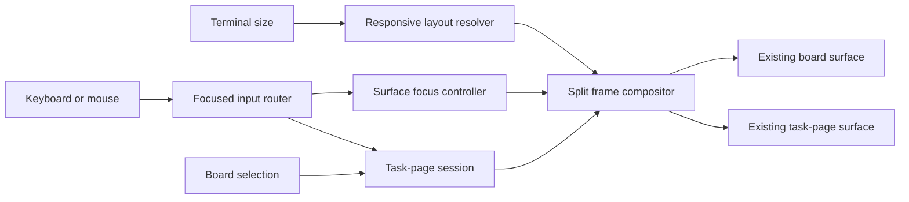

# Wide task split

Feature: a responsive two-surface board at wide terminal widths, keeping queue context and the complete selected-task workflow visible together.

## Brief

> **Superseded in part.** [stage-slider-rework.md](stage-slider-rework.md) replaced this
> brief's geometry, chrome, focus signalling, and key/mouse routing before the branch
> landed: a four-stage slider (0 · A · G · F) instead of a 50/50 split, one dim rule column
> instead of a cyan-bordered panel, density following the frame, and the stage as the sole
> focus source. The problem, the dirty-edit protection, resize continuity, and everything
> below 110 columns survive unchanged.

<!-- source: user-guided interaction design settled in chat, 2026-09-02 · ingested 2026-09-02 -->

**Problem.** At wide terminal widths, the board leaves horizontal space underused while task work still requires replacing the queue with a full-page task view. The inline peek preserves queue context but is intentionally incomplete: it cannot provide the full notes, steps, metadata, editing, and task-page controls. Moving between the queue and a task therefore costs context exactly when enough space exists to show both.

**Scope.** At 110 usable columns or wider, the board becomes a four-stage slider: stage 0 shows the board alone; stage A puts the board beside the complete task page; stage G swaps the board for a dim 32-column rail; stage F shows the page alone. One dim `│` rule column and one pad cell separate the columns; there is no box and no colour anywhere. Focus is the stage: the board owns 0 and A, the task owns G and F. `→` and `←` slide one stage, `Enter` opens F and records the origin, `Esc` returns there. In A, changing the board selection retargets the pane without opening an inline peek. The task side follows the same view, edit, step, scroll, mouse, verb, save, and refusal behavior as the existing full-page task page. Everything stays monochrome at every width.

At widths below 110, exactly one surface fills the frame. Shrinking keeps whichever surface was focused: board focus yields the board; task focus yields the full-page task view; an active task edit yields the corresponding full-page task editor with its draft and cursor intact. Growing back to 110 or wider restores the split with the same focus and session state. While task edits are unsaved, attempts to select another task are refused until the edit is saved or cancelled.

**Non-goals.** No draggable or persisted split ratio; no second task-detail implementation with preview-only behavior; no domain, store, task, or status change; no new color or theme machinery; no change to single-pane task-page behavior; no removal of peek below 110 columns.

**Chosen approach.** One responsive board surface whose wide presentation is a stage slider, over a separate read-only preview or a manually toggled panel. The wide task side is the task page itself, so resizing changes layout rather than changing the user's task session, and a rail stage keeps navigation context beside the page without spending half the frame on a board the user has left.

**Resolved key decisions.** Wide activates at 110 usable columns, inclusive, with no separate height trigger beyond the product's existing operability floor. Stages A and G divide the frame between a left column (board at `floor(w * 0.4)` in A, a 32-column rail in G), one rule column, and the task column; stages 0 and F use the whole frame. The board opens in stage 0. `→`/`←` slide the stage in Normal and TaskPage view mode; `Enter` opens F and `Esc` restores the origin stage, while an active editor retains its existing key handling. Wide selection paints no inline peek. Resize preserves selection, scroll, stage, task-page state, drafts, and cursor. A dirty task edit locks task switching and explains the refusal. Mouse interaction follows the stage and the existing task-page controls.

**Glossary terms touched.** wide stage, rail, focused surface (mirrored into `CONTEXT.md`).

**ADRs.** None. The responsive presentation is additive, reversible, and follows the existing deferred wide-tier direction; it does not change a persistence or trust boundary.

## Acceptance Criteria

> Superseded in part by [stage-slider-rework.md](stage-slider-rework.md): geometry, chrome,
> focus signalling and key/mouse routing follow the four-stage slider (0 · A · G · F). AC-7,
> AC-8, AC-10 and AC-11 read through that document's key and mouse tables; AC-3 and AC-21 to
> AC-24 below state the slider's own contract. Dirty-edit protection (AC-14 to AC-17), resize
> continuity (AC-12, 13, 15, 19, 20) and no domain mutation from layout stay as written.

For AC-9, **the same outcome** means that, from the same task, task-page session state, and task-surface width and height, an input produces the same task-page intent, domain change, page-session transition, wrapping, and text inside the task surface. The focused-surface marker and the layout-only return from task view to the board are excluded.

### Layout

**AC-1** At exactly 110 usable columns, the board and the selected task view both render in one frame. *(Verification type: **test-backed**: unit)*

**AC-2** At 109 usable columns, only the focused surface renders. *(Verification type: **test-backed**: unit)*

**AC-3** Wide stages A and G divide all usable columns between a left column, exactly one rule column painting `│`, and a task column whose first cell is a pad; there is no box, no border ring, and no gap. Stage A's left column is `floor(w * 0.4)` wide, stage G's rail is 32. *(Verification type: **test-backed**: property)*

**AC-4** At every width of at least 110 columns and every supported height of at least 10 rows, wide split view paints entirely within the frame. *(Verification type: **test-backed**: property)*

### Selection and focus

**AC-5** Changing board selection in wide split view immediately changes the right side to the newly selected task. *(Verification type: **test-backed**: unit)*

**AC-6** Wide split view paints no inline peek body for any board task. *(Verification type: **test-backed**: unit)*

**AC-7** From board focus, bare `Enter` or `→` transfers focus to task view without changing the selected task. *(Verification type: **test-backed**: unit)*

**AC-8** From task view mode, bare `Esc` or `←` transfers focus to the board without changing the selected task or task-page session state. Active editors retain their existing task-page key handling. *(Verification type: **test-backed**: unit)*

**AC-9** Except for the focus transitions defined by AC-7 and AC-8, every supported task-page keyboard and mouse input has the same outcome in the focused right side as in single-pane task view. *(Verification type: **test-backed**: integration)*

**AC-10** Clicking a board task in wide split view selects that task and gives the board focus. *(Verification type: **test-backed**: unit)*

**AC-11** Clicking an interactive task-side region in wide split view gives task view focus before dispatching that region's task-page action. *(Verification type: **test-backed**: unit)*

### Responsive transitions

**AC-12** Shrinking below 110 columns with board focus produces the single-pane board with selection and list scroll unchanged. *(Verification type: **test-backed**: integration)*

**AC-13** Shrinking below 110 columns with task focus produces the single-pane task view with task scroll and page-session state unchanged. *(Verification type: **test-backed**: integration)*

**AC-14** Shrinking below 110 columns during a task edit produces the corresponding single-pane task editor with input mode, draft, and cursor unchanged. *(Verification type: **test-backed**: integration)*

**AC-15** Growing from below 110 columns to at least 110 columns restores wide split view with the same focused surface and session state. *(Verification type: **test-backed**: integration)*

### Safety and empty state

**AC-16** While task edits are unsaved, an attempt to select another board task is refused and the bound task remains selected. *(Verification type: **test-backed**: unit)*

**AC-17** A refused task switch under AC-16 shows a save-or-cancel message while preserving the draft; the message clears when the edit is saved or cancelled. *(Verification type: **test-backed**: unit)*

**AC-18** With no selected task, the wide task side paints an inert empty state. *(Verification type: **test-backed**: unit)*

**AC-19** Repeatedly resizing once below and once above the 110-column threshold leaves the board process running. *(Verification type: **test-backed**: e2e)*

**AC-20** Crossing the 110-column threshold without invoking a task verb produces no domain mutation. *(Verification type: **test-backed**: integration)*

### Stage slider

**AC-21** At 110 usable columns or wider the board is a four-stage slider whose stage is the focus owner: `FullBoard` (board, full width), `Split` (board beside the task page, board focus), `Rail` (dim 32-column rail beside the page, task focus), `FullTask` (page, full width). Bare `→` / `←` move one stage (inert at the ends), `Enter` from 0, A or G opens F and records the origin, `Esc` from F returns there and from G returns to A, `←` from F always goes to G, `Tab` is never a stage key, and stages A, G and F cannot be entered without a selected task. The stage is session-only, opens at `FullBoard`, and survives threshold crossings. *(Verification type: **test-backed**: unit)*

**AC-22** At wide widths exactly one footer paints across the whole frame: one footer rule row, one status row (left: today's content; right: a dim stage crumb and the keys that apply, dropped crumb-first when the left text needs the room), one verb bar following focus with its `ctrl+` prefixes and leading space. The task column paints no bottom chrome of its own, and its in-page header row and divider are replaced by a two-row header: the status glyph, `T<n> title`, and the state slot (`status · project`; `editing <field>`; `unsaved`) on the selector row, DIM in A and BOLD in G and F, with a dash rule on the row under it. *(Verification type: **test-backed**: unit)*

**AC-23** Every frame is monochrome at every width and stage: `assert_buffer_mono` holds, and there is no colour exception for wide chrome. *(Verification type: **test-backed**: property)*

**AC-24** Rail rows are `  <mark> T<n> <title>` wrapped with `edit::wrap_text` at the rail width with a continuation indent four cells past the row's own lead (a threaded row keeps the board's thread indent, so its continuation is lead + 4); a title longer than the rail occupies several rows, is never truncated, and no glyph touches the rule column. The selected rail row paints `▹`; the rail has no meta column and no done drawer; every rail cell carries DIM. *(Verification type: **test-backed**: unit)*

### Negative criteria

- NC-1: No draggable panel boundary or ratio-setting control.
- NC-2: No split ratio, focused surface, or responsive-layout state is persisted.
- NC-3: No task, domain, store, status, or history schema changes.
- NC-4: No new color, theme, or styling machinery.
- NC-5: Below 110 columns, existing board peek and single-page task behavior remain available.
- NC-6: No separate preview-only task implementation.

### Verification map

| Criterion | Oracle |
| --- | --- |
| AC-1 | unit test |
| AC-2 | unit test |
| AC-3 | property test |
| AC-4 | property test |
| AC-5 | unit test |
| AC-6 | unit test |
| AC-7 | unit test |
| AC-8 | unit test |
| AC-9 | integration test |
| AC-10 | unit test |
| AC-11 | unit test |
| AC-12 | integration test |
| AC-13 | integration test |
| AC-14 | integration test |
| AC-15 | integration test |
| AC-16 | unit test |
| AC-17 | unit test |
| AC-18 | unit test |
| AC-19 | e2e test |
| AC-20 | integration test |
| AC-21 | unit test |
| AC-22 | unit test |
| AC-23 | property test |
| AC-24 | unit test |

### Deferred

None.

### Glossary terms touched

Wide stage, rail, focused surface (derived from stage) — mirrored into `CONTEXT.md`.

## Design

> **Superseded in part.** The component descriptions below were written for the boxed
> 50/50 design. [stage-slider-rework.md](stage-slider-rework.md) is the authoritative
> model: the layout resolver takes a `WideStage` instead of a focused surface, focus
> derives from the stage, and the compositor is the column + rule + shared-footer
> painter in `src/ui/board/draw.rs`.

Feature-level design fitted into the existing board architecture. Domain, persistence, queue derivation, and task-page behavior remain unchanged; this feature separates presentation geometry and focus ownership from the task-page session they display.

### Components

1. **Responsive layout resolver** *(rewritten)*: owns the pure mapping from usable frame dimensions and a `WideStage` to the stage's rectangles: board (or rail), one rule column, and task column, with the task rect's first cell as a pad (`task_content`). Stages 0 and F use the whole frame; below 110 the stage picks the single-pane presentation (0/A the board, G/F the page). Density follows the frame, so a split at 130×24 stays standard and stage A keeps the board's meta column. It returns bounded zero-area rectangles rather than errors at pathological dimensions and never changes session or domain state.
2. **Stage slider** *(rewritten from the surface focus controller)*: session state on `BoardModel` (`wide_stage` + `stage_origin`); the focused surface derives from the stage. `StageRight`/`StageLeft` slide one step with a no-selection guard; `OpenTaskPage` records the origin and `CloseLayer` restores it; a left-side click lands the board in A. Shrinking changes presentation but not the stage; growing restores the stage's layout. Editors keep their existing key semantics. It never creates, saves, cancels, or discards task state.
3. **Task-page session**: owns the task-side binding and all existing page-session state: task id, page scroll, step cursor, form, draft, cursor, input mode, and dirty state. Contract: input is board selection, the current task snapshot, and existing task-page actions; output is a task-page payload, an inert empty payload, or a task-switch refusal. A clean board selection rebinds the session; a dirty session preserves its binding and draft and refuses retargeting. A missing or no-longer-visible selected task yields the empty payload or follows the existing selection-reanchor rule, never a stale actionable task.
4. **Focused input router**: owns dispatch of keyboard and mouse input to the focused surface. Contract: input is an event, resolved rectangles and hit regions, focused surface, and task-page input mode; output is an existing board/task intent, a focus-transfer request, or no action. Board-view `Enter`/`→` requests task focus; task-view `Esc`/`←` requests board focus; active editors route those keys through their existing editor map. Coordinates outside a live hit region are ignored. The router introduces no mutating intent and does not persist.
5. **Stage compositor** *(rewritten from the split frame compositor)*: owns presentation composition only. Contract: input is resolved geometry, existing board paint input, the task-page payload or the absence of a task, and the stage; output is clipped terminal cells plus one combined hit map. In stages A and G it paints the board or rail column, one dim `│` rule column, the task column with its two-row header (status glyph, `T<n> title`, and the state slot, DIM in A and BOLD in G and F, with a dash rule on the row under it), the page body, and exactly one shared footer (rule, status row with the dim stage crumb, verb bar following focus); there is no border ring and no colour anywhere. In stages 0 and F it paints the single surface across the whole frame. It suppresses inline peek only at wide widths, records no hits for the empty pane, and delegates task wrapping, controls, markdown, steps, metadata, and edit rendering to the existing task-page renderer.

### Data flow and key state

Each settled frame maps terminal size and current focus through the Responsive layout resolver. The Split frame compositor then paints one or both existing surfaces inside the returned rectangles and combines their local hit regions into frame coordinates. Resize events run this flow without issuing an intent or touching domain state.

With board focus, navigation changes the board selection. The Task-page session rebinds to that id when clean, rebuilds the ordinary task-page payload, and the compositor repaints the right side. `Enter`, `→`, or a task-side click flows through the Focused input router to the Surface focus controller. Once task-focused, all ordinary page inputs flow through the existing task-page actions. Returning to board focus retains the clean task-page session so scroll and selection survive another focus or resize transition.

Persisted state is unchanged. Session-only state adds the focused surface and retains the task-side binding alongside the existing list scroll, page scroll, form, draft, cursor, and input mode. Layout mode and split ratio are derived every frame and are never persisted. A task-page session is dirty only when a task-field draft differs from its bound snapshot, an existing-step change or removal is staged, or a non-empty new-step draft exists; merely entering an editor does not make the session dirty.

### Trust and failure boundaries

Task title, notes, steps, thread, scope labels, and refusal text remain untrusted terminal input and cross only the existing bounded text-paint boundary. Split rectangles and translated mouse coordinates are validated against the resolved frame before dispatch; out-of-bounds input is inert. A stale or absent task binding cannot produce task hits or verbs.

A dirty task session is the task-switch boundary: retargeting refuses before selection or binding changes, preserves the draft, and owns a visible save-or-cancel message until resolution. Persistence failure remains inside the existing save-recovery boundary; layout and focus transitions cannot clear the form or input mode while recovery is unresolved. Repeated or coalesced resize events are presentation-only and cannot produce domain commands.

### Criterion-to-component map

| Criterion | Component |
| --- | --- |
| AC-1 | Responsive layout resolver, Split frame compositor |
| AC-2 | Responsive layout resolver, Split frame compositor |
| AC-3 | Responsive layout resolver |
| AC-4 | Responsive layout resolver, Split frame compositor |
| AC-5 | Task-page session, Split frame compositor |
| AC-6 | Split frame compositor |
| AC-7 | Focused input router, Surface focus controller |
| AC-8 | Focused input router, Surface focus controller, Task-page session |
| AC-9 | Focused input router, Task-page session, Split frame compositor |
| AC-10 | Focused input router, Surface focus controller, Task-page session |
| AC-11 | Focused input router, Surface focus controller |
| AC-12 | Responsive layout resolver, Surface focus controller, Task-page session |
| AC-13 | Responsive layout resolver, Surface focus controller, Task-page session |
| AC-14 | Responsive layout resolver, Surface focus controller, Task-page session |
| AC-15 | Responsive layout resolver, Surface focus controller, Task-page session |
| AC-16 | Task-page session, Focused input router |
| AC-17 | Task-page session, Split frame compositor |
| AC-18 | Task-page session, Split frame compositor |
| AC-19 | Responsive layout resolver, Surface focus controller, Split frame compositor |
| AC-20 | Responsive layout resolver, Surface focus controller |

### Outside the checker

1. **Existing domain and persistence path**: remains the sole owner of task mutations, revision guards, durable writes, and save recovery. The wide split adds no domain command or persisted field.
2. **Existing board and task-page surfaces**: remain the presentation and interaction sources reused inside the compositor; the feature does not fork their behavior.

### ADRs created

None. The responsive presentation is additive and reversible, introduces no persistence or trust boundary, and follows the existing deferred wide-tier direction.

### Glossary terms touched

Wide stage, rail, focused surface (derived from stage) — mirrored into `CONTEXT.md`.

## Tech Stack

### Choices

**No new products or dependencies.** This feature reuses the repository's pinned Rust `1.96.0`, Ratatui `0.30.2`, and Crossterm `0.29.0` stack, checked 2026-09-02. Ratatui's frame API accepts bounded rectangular subareas and Crossterm exposes resize events as `(columns, rows)`, so the approved design fits the existing event and paint model without another layout or UI dependency.

- Ratatui `0.30.2`: https://docs.rs/ratatui/0.30.2/ratatui/struct.Frame.html
- Crossterm `0.29.0`: https://docs.rs/crossterm/0.29.0/crossterm/event/enum.Event.html
- Rust/Cargo `1.96.0`: https://doc.rust-lang.org/1.96.0/cargo/commands/cargo-test.html

**Load-bearing claim, verified-by-probe:** the pinned stack can represent a `110×24` resize event and paint two bounded regions separated by one column in one frame. Kept output: `docs/specs/wide-task-split/probes/existing-terminal-stack.txt`. The probe ran in a 10-minute throwaway tree outside the product and the source tree was deleted after capture.

Rejected: a split-layout dependency duplicates the existing rectangular layout capability; a second terminal UI framework would change the approved shape and duplicate the current renderer, input, and test stack.

### Component-to-product map

No new products: reuses the declared stack (green bar: `cargo fmt --check && cargo clippy --all-targets -- -D warnings && cargo test && cargo build --release`).

### Unverified / flagged

None.

### Glossary terms touched

None.

## Plan

### Tasks

**T-1: Define the responsive split geometry contract.** Add a pure resolver that maps usable frame dimensions and retained focus to single-board, single-task, or equal wide-split geometry. At 110 columns and above, divide all columns between touching left and right allocations, keep their widths within one column, use the complete left allocation for board content, inset the right content for its task border, and choose one shared internal density from the narrower content rectangle. Keep the existing standard/compact resolver unchanged for ordinary single-surface callers.

- Files: `src/ui/tier.rs`, `src/ui/board/mod.rs`, `tests/wide_task_split.rs` (new), `CONTEXT.md`.
- Test first: add `wide_geometry_activates_at_110_and_109_stays_single`, `wide_geometry_balances_touching_allocations_without_a_gap`, `wide_geometry_uses_narrower_content_for_shared_density`, and `wide_geometry_is_bounded_across_supported_sizes`; run them against the pre-change resolver and observe the missing geometry contract fail before implementation.
- Compile fallout: expose only the geometry types needed by the board compositor and integration tests; preserve every existing `resolve` result and standard/compact breakpoint below this new composition layer. Mirror the approved wide stage, rail, and focused surface (derived from stage) terms into `CONTEXT.md` without implementation detail.
- Review boundary: the deterministic geometry policy is a complete, independently testable artifact. It introduces no paint, input, or state transition.

*Advances:* AC-3. *Component:* Responsive layout resolver. *Deps:* none.

**T-2: Render a bounded read-only wide split.** Consume T-1 geometry to paint the ordinary board beside the selected task's existing read-only task-page surface. Paint the board across its full left allocation, paint one focus-styled task border on the right, translate and clip task hit/copy regions to that bordered interior, suppress only wide-mode peek, and paint an inert empty task side when selection is absent. Preserve all existing zero-origin rendering below 110 columns.

- Files: `src/ui/render.rs`, `src/ui/board/draw.rs`, `src/ui/board/mod.rs`, `tests/wide_task_split.rs`, `tests/queue_board_render.rs`.
- Test first: add `wide_layout_activates_at_110_and_109_stays_single_pane`, `wide_split_never_paints_or_hits_outside_supported_frames`, `wide_board_selection_repaints_task_side_without_inline_peek`, and `wide_split_without_selection_paints_inert_task_empty_state` to `tests/wide_task_split.rs`; run them against the pre-change renderer and observe the missing split fail before implementation.
- Compile fallout: keep direct renderer fixtures working at zero origin; update every clear, line, cursor, scrollbar, hit region, and copyable rectangle used by either embedded surface to honor its bounded origin; update exhaustive overlay matches and direct renderer call sites in this task.
- Review boundary: useful read-only wide browsing is complete and reversible here; no focus or edit routing is introduced yet.

*Advances:* AC-1, AC-2, AC-4, AC-5, AC-6, AC-18. *Component:* Split frame compositor. *Deps:* T-1.

**T-3: Add surface focus and lossless responsive transitions.** Add session-only board/task focus, explicit non-persisting focus-transfer intents, and a retained clean task-page session. Wide board-view `Enter`/`→` focuses the selected task; task-view `Esc`/`←` returns to the board without clearing page state. Below 110 columns, render the retained focused surface full-frame. Crossing the threshold only recomputes presentation, preserving selection, list scroll, task scroll, step cursor, and clean page state. Keep ordinary below-threshold `Enter` task-page opening and active-editor key handling unchanged. Exercise the real settled frame path across the threshold and prove that layout/focus transitions alone issue no domain mutation.

- Files: `src/ui/board/model.rs`, `src/ui/board/apply.rs`, `src/ui/board/draw.rs`, `src/ui/board/mod.rs`, `src/ui/input.rs`, `src/app.rs`, `tests/wide_task_split.rs`, `tests/queue_board_loop.rs`.
- Test first: add `wide_board_enter_and_right_focus_the_same_selected_task`, `task_view_escape_and_left_return_focus_without_resetting_page_session`, `shrinking_with_board_focus_preserves_selection_and_list_scroll`, `shrinking_with_task_focus_preserves_page_scroll_and_session`, and `growing_back_to_wide_restores_focus_and_page_session` to `tests/wide_task_split.rs`; add `repeated_threshold_resizes_keep_board_loop_live` and `threshold_crossings_without_task_verbs_leave_domain_unchanged` to `tests/queue_board_loop.rs`; observe the focus and responsive-loop path fail before adding focus state.
- Compile fallout: cover the new focus intents in every exhaustive intent match, classify them non-persisting, keep save-recovery routing intact, and route paste, drag auto-scroll, wheel, and scrollbar ownership by presentation plus focused surface rather than treating task-page mode as equivalent to a full-frame takeover. Reuse the existing public `board_frame` and `draw_board` seams for loop verification rather than adding a second resize simulator.
- Review boundary: keyboard focus, resize continuity, loop liveness, and domain immutability are complete; mouse parity and dirty retargeting remain unchanged until their dedicated slices.

*Advances:* AC-7, AC-8, AC-12, AC-13, AC-15, AC-19, AC-20. *Component:* Surface focus controller. *Deps:* T-2.

**T-4: Route full task-page input through the focused side.** Route task-focused keyboard and mouse events through the existing task-page and editor maps without copying their tables. Compose translated renderer-produced hit maps, make a board-row click select once and restore board focus without wide peek or wide double-click takeover, and make a task-side control click focus task view before dispatch. Add an equal-geometry parity table covering current task view, field edit, scope, thread, step, scrollbar, text-selection, task-number-copy, and verb paths. Update operator and site documentation plus the browser demo for the inclusive 110-column split and focus keys, retaining the demo's intentional bare mutating verbs.

- Files: `src/app.rs`, `src/ui/input.rs`, `src/ui/mouse.rs`, `src/ui/board/apply.rs`, `src/ui/board/draw.rs`, `tests/wide_task_split.rs`, `AGENTS.md`, `docs/technical/board-ui.md`, `docs/technical/app.md`, `site/src/content/docs/docs/board.md`, `site/src/content/docs/docs/keys.md`, `site/src/content/docs/docs/task-page.md`, `site/public/board-demo.js`, `site/src/styles/landing.css`, `site/test/site.test.mjs`.
- Test first: add `focused_wide_task_surface_matches_single_pane_keyboard_and_mouse_outcomes`, `wide_board_task_click_selects_and_returns_board_focus`, `wide_task_control_click_focuses_task_before_dispatch`, and `wide_mouse_coordinates_outside_live_surface_hits_are_inert` to `tests/wide_task_split.rs`; add `docs_and_demo_describe_wide_surface_focus_and_threshold` to `site/test/site.test.mjs`; observe the parity and documentation checks fail before implementation.
- Compile fallout: update every mouse and app-loop branch whose surface currently follows only `BoardInputMode`; preserve the current task field and step-edit routes from the in-progress board work; keep local coordinate translation at the compositor boundary so no second hand-maintained hit geometry appears.
- Verification in this slice: run the Rust green bar, then `npm test && npm run build` from `site/`.

*Advances:* AC-9, AC-10, AC-11. *Component:* Focused input router. *Deps:* T-3.

**T-5: Preserve active editors and guard dirty task switching.** Implement one geometry-free task-session dirty predicate using the approved definition. Route every task-selection replacement through one retarget boundary: a clean session may bind the requested task, while a dirty session keeps selection, binding, scroll, input mode, drafts, staged step changes, and cursor unchanged and shows a save-or-cancel refusal. Successful save or explicit cancel clears the refusal. Resize never invokes retargeting, so a focused editor shrinks full-frame and grows back into the right side without state loss. Persistence failure continues to retain the form and mode through existing save recovery.

- Files: `src/ui/board/model.rs`, `src/ui/board/apply.rs`, `src/ui/board/draw.rs`, `src/app.rs`, `tests/wide_task_split.rs`.
- Test first: add `shrinking_during_task_edit_preserves_mode_draft_cursor_and_binding`, `dirty_wide_task_session_refuses_keyboard_task_switch`, `dirty_wide_task_session_refuses_mouse_task_switch_and_keeps_binding`, `dirty_switch_refusal_preserves_draft_and_clears_after_save`, and `dirty_switch_refusal_clears_after_cancel`; observe the pre-change selection replacement or missing split state fail before the guard.
- Compile fallout: cover next/previous navigation, direct row selection, mouse selection, and any reanchor route that can replace the selected id; do not block same-task selection or merely focused-but-unchanged editors; retain the existing rule that forms and modes outlive failed saves.
- Review boundary: dirty-edit safety and active-editor resize behavior are complete without changing domain or persistence semantics.

*Advances:* AC-14, AC-16, AC-17. *Component:* Task-page session. *Deps:* T-4.

### Task-to-criterion coverage map

| Criterion | Advanced by |
| --- | --- |
| AC-1 | T-2 |
| AC-2 | T-2 |
| AC-3 | T-1 |
| AC-4 | T-2 |
| AC-5 | T-2 |
| AC-6 | T-2 |
| AC-7 | T-3 |
| AC-8 | T-3 |
| AC-9 | T-4 |
| AC-10 | T-4 |
| AC-11 | T-4 |
| AC-12 | T-3 |
| AC-13 | T-3 |
| AC-14 | T-5 |
| AC-15 | T-3 |
| AC-16 | T-5 |
| AC-17 | T-5 |
| AC-18 | T-2 |
| AC-19 | T-3 |
| AC-20 | T-3 |

### Notes

- The implementation overlaps the current uncommitted board/task-page work in `src/app.rs`, `src/ui/board/{apply,draw,model}.rs`, `src/ui/{input,mouse,render}.rs`, and site task-page/key documentation. Build must not reset, stash, overwrite, or fold those unrelated changes into this feature; begin only from an owner-approved clean base or isolated worktree containing the intended prerequisite commits.
- Every regression test must be observed failing without its fix, then restored green with the fix.
- Green bar after every task: `cargo fmt --check && cargo clippy --all-targets -- -D warnings && cargo test && cargo build --release`.
- Site verification after T-4 and finally: `npm ci && npm test && npm run build` from `site/`.
- Final verification also runs `git diff --check` and confirms unrelated dirty files remain untouched.
- Because `HERDR_ENV=1`, final verification requires a release rebuild and live Herdr smoke with isolated `TSK_STATE_DIR` and `TSK_CONFIG_DIR`: cross 109↔110 repeatedly, verify both focus directions, selection-driven task rebinding, no wide peek, task scroll continuity, active edit shrink/grow, dirty-switch refusal, save/cancel clearing, and task-side mouse controls.
- No `constitution.md` exists in this repository; standing product constraints were checked against `AGENTS.md`, `AGENTS.local.md`, and `docs/technical/invariants.md` instead.
